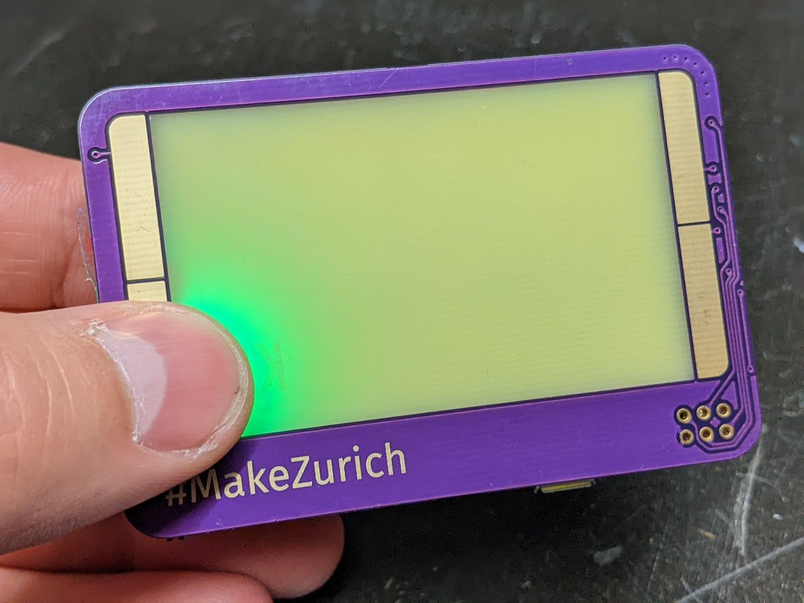
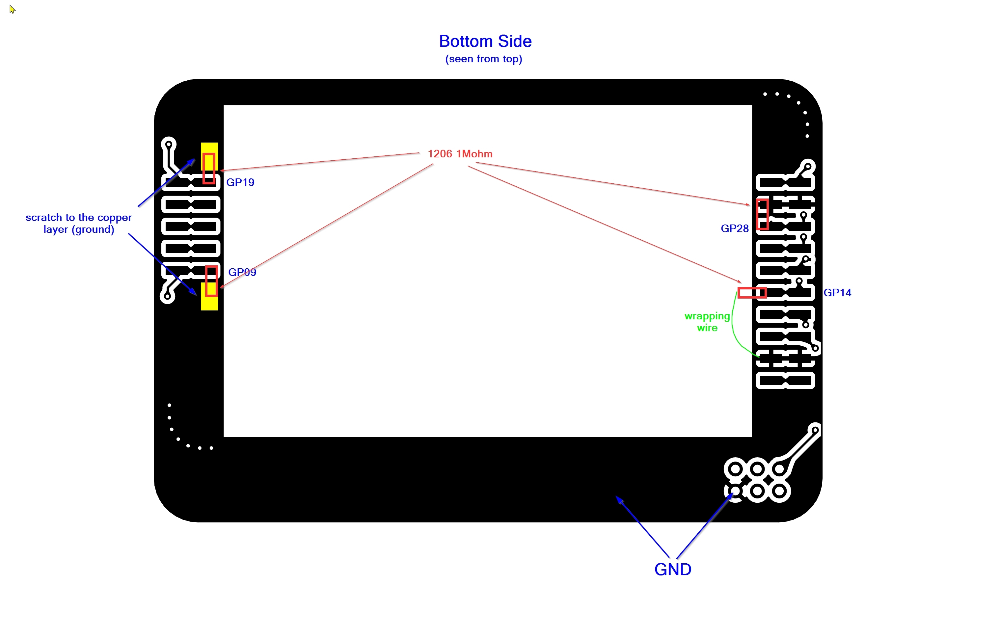
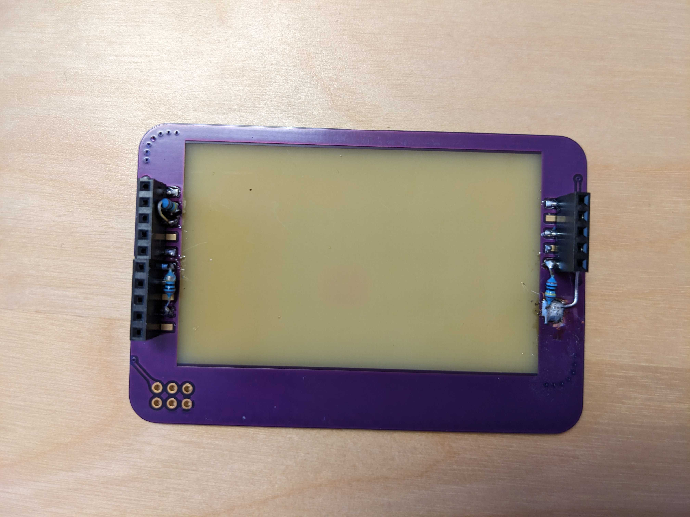
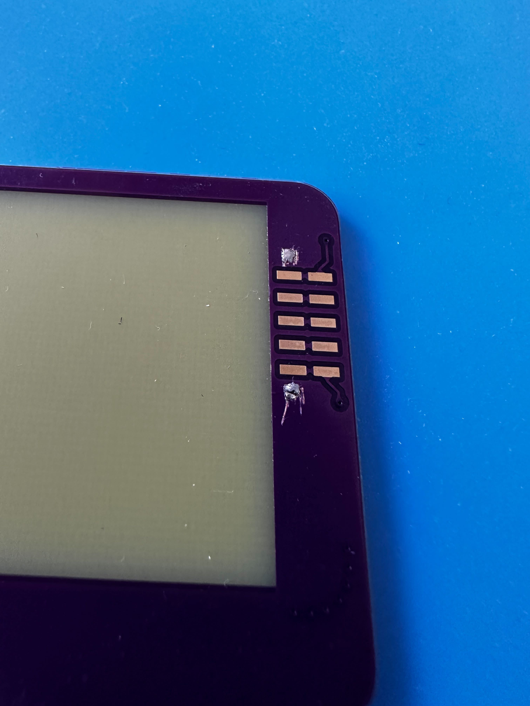
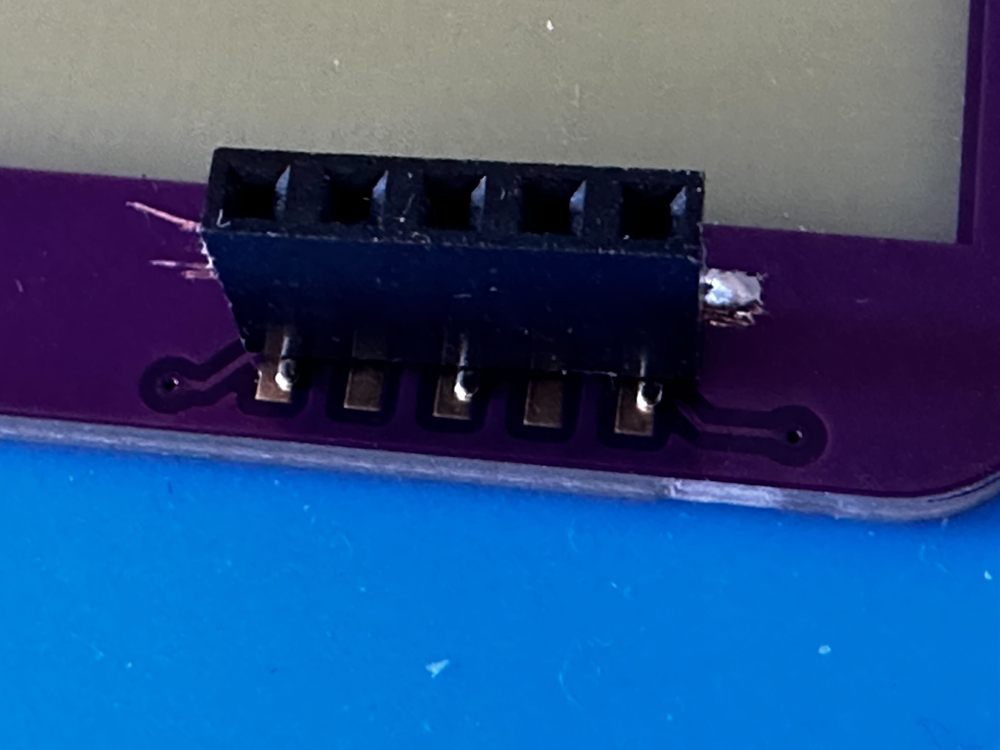
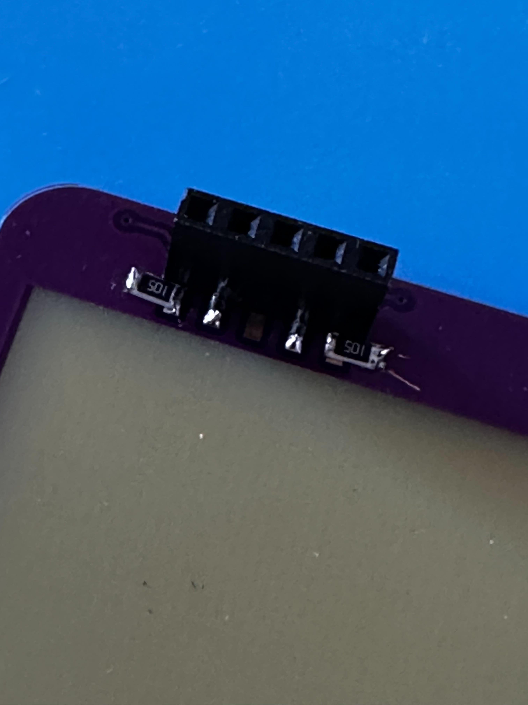
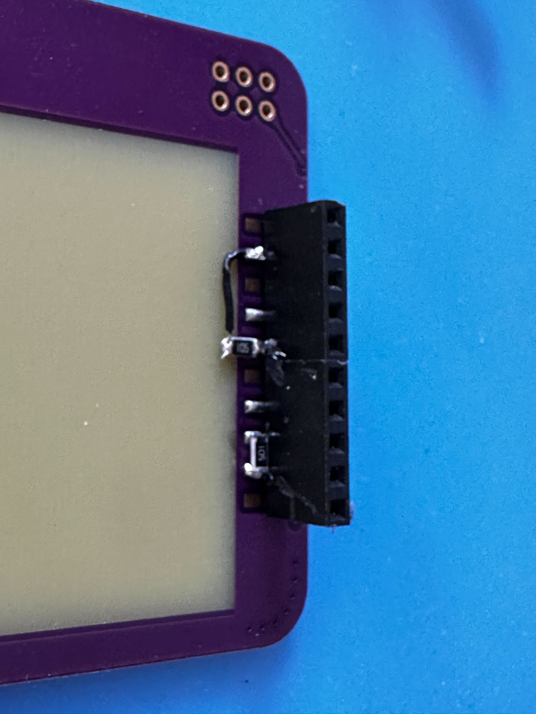
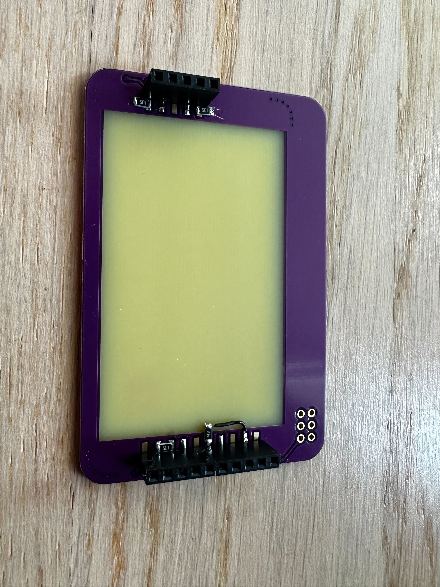

# Cover modification needed for first version of badge cover

In order to get the touch sensing working with the standard CircuitPython core using touchio, a 1M Ohm resistor needs to be soldered from each of the pads and connected to GND.

Technically without the cover you can also attach a wire to the pin and connect the pin in parallel to GND with a 1M Ohm resistor and the wire (even insulated part) will correspondingly be an input (you can stick it into a Banana and then you will have a Banana input, whatever has enough liquid and is conducting on the surface).

# Proposed wiring
GP9 => TP1 (Touchpad upper left side) => 1M Ohm Resistor => GND
GP19 => TP2 (Touchpad lower left side) => 1M Ohm Resistor => GND
GP28 => TP3 (Touchpad upper right side) => 1M Ohm Resistor => GND
GP14 => TP4 (Touchpad lower right side) => 1M Ohm Resistor => GND

# Impressions from the soldering process
## through-hole (first attempt)

## SMD (second variation)

